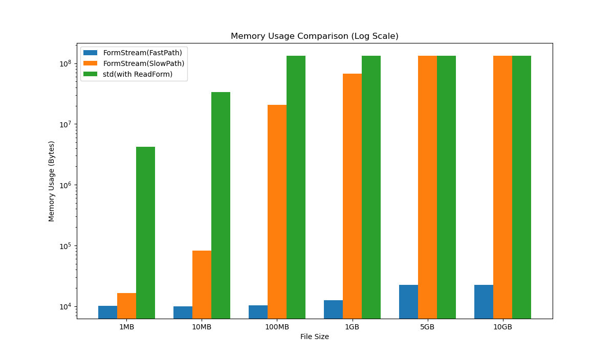
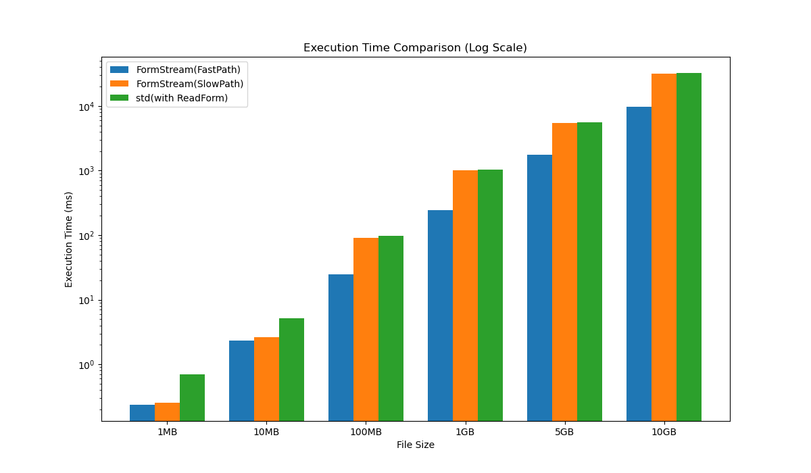

# FormStream

[](https://github.com/mazrean/formstream/releases/)

[](https://codecov.io/gh/mazrean/formstream)
[](https://pkg.go.dev/github.com/mazrean/formstream)

FormStream is a Golang streaming parser for multipart.

## Features

- Streaming parser, no need to store the whole file in memory or on disk in most cases
- Extremely low memory usage
- Fast, fast, fast!

## Benchmarks

For all file sizes, FormStream is faster and uses less memory than [`mime/multipartform`](https://pkg.go.dev/mime/multipart).

<details>
<summary>Environment</summary>

- OS:
- CPU:
- RAM:
- Disk:
- Go version:
</details>




> [!NOTE]
> FormStream is extremely fast by using a stream when parsing a multipart that satisfies certain conditions (FastPath in the graph).
> It is fast enough even when no conditions are met (SlowPath in the graph), but only slightly faster than `mime/multipart`.
> If you want to know more details, see [How it works](./#how-it-works).

## Install

```sh
go get github.com/mazrean/formstream@latest
```

## Usage

### Basic

<details>
<summary>Example data</summary>

```text
--boundary
Content-Disposition: form-data; name="name"

mazrean
--boundary
Content-Disposition: form-data; name="password"

password
--boundary
Content-Disposition: form-data; name="icon"; filename="icon.png"
Content-Type: image/png

icon contents
--boundary--
```
</details>

```go
parser, err := formstream.NewParser(r)
if err != nil {
    return err
}

err = parser.Register("icon", func(r io.Reader, header formstream.Header) error {
    name, _, _ := parser.Value("name")
    password, _, _ := parser.Value("password")

    return saveUser(r.Context(), name, password, r)
}, formstream.WithRequiredPart("name"), formstream.WithRequiredPart("password"))
if err != nil {
    return err
}

err = parser.Parse()
if err != nil {
    return err
}
```

### `net/http`, `Echo`, `Gin`

Use wrapper for each library.

- [net/http](./http)
- [Echo](./echo)
- [Gin](./gin)

## How it works

FormStream offers an improved approach to processing multipart data, a format commonly utilized in web form submissions and file uploads.

### Understanding Multipart Data
Multipart data is organized with distinct boundaries separating each segment. Consider the following example:

```text
--boundary
Content-Disposition: form-data; name="description"

file description
--boundary
Content-Disposition: form-data; name="file"; filename="large.png"
Content-Type: image/png

large png data...
--boundary--
```

When dealing with large files, streaming the data is essential for effective memory management. In the example above, streaming is implemented by sequentially processing each part from the beginning, a task accomplished with the `(*Reader).NextPart` method found in the `mime/multipart` package.

### Alternative Parsing Method
`mime/multipart` also includes the `(*Reader).ReadForm` method for parsing multipart data. Unlike the streaming approach, `(*Reader).ReadForm` temporarily saves the data in memory or a file, leading to slower processing. This method is prevalently used in web frameworks such as `net/http`, `Echo`, and `Gin`, particularly because it can manage parts arriving in a non-sequential order. For instance:

```text
--boundary
Content-Disposition: form-data; name="file"; filename="large.png"
Content-Type: image/png

large png data...
--boundary
Content-Disposition: form-data; name="description"

file description
--boundary--
```

With `NextPart`, processing is strictly sequential. If later parts (e.g., 'description') contain information required to process earlier parts (e.g., a large file), the data must be temporarily stored on disk or in memory.

### Efficient Processing Strategies
The most efficient strategies for handling multipart data include:
- Stream processing with `(*Reader).NextPart` when the necessary data for a part is readily available.
- Temporarily storing data on disk or in memory, then processing it as needed with `(*Reader).ReadForm` when required data for a part is initially unavailable.

### Advantages of FormStream
FormStream optimizes this workflow. It is faster than the `(*Reader).ReadForm` method and more flexible than `(*Reader).NextPart`, as it can process multipart data in any sequence. This versatility makes FormStream an ideal solution for various multipart data handling scenarios.

